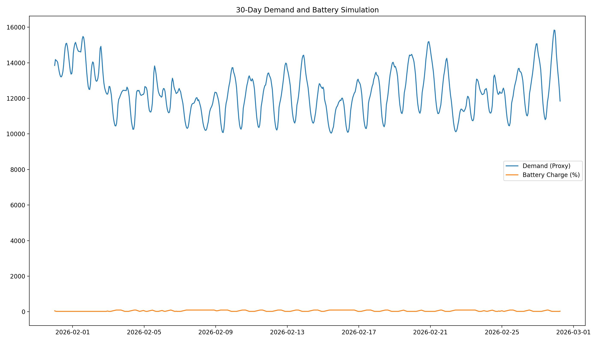

## Energy Simulation for Battery Optimization

This project simulates how a compute cluster could intelligently decide **when to charge a battery, run on grid power, or run on battery** using real grid data.

The system pulls **real hourly electricity data from the U.S. Energy Information Administration (EIA)** and combines it with simulated compute demand and battery behavior to model decision-making for energy-aware infrastructure.

This prototype is part of an exploration into **energy-aware scheduling for AI / GPU workloads.**

---

## Project Goal

The goal is to develop a model that:

1. Uses real grid signals
2. Simulates compute infrastructure power demand
3. Simulates battery constraints
4. Makes hourly decisions on energy usage

The decision engine determines whether the system should:

- Charge the battery
- Run compute from the grid
- Run compute from the battery

---

## Data Sources

### Real Data

**Source:** EIA API  
https://www.eia.gov/opendata/

**Currently pulled:**
- Hourly grid demand (used as a proxy for electricity price)

**Future integration:**
- Real hourly electricity prices
- Demand forecasts

---

## Simulated System Components

### Battery Model

| Variable | Description |
|----------|-------------|
| Battery Charge | 0–100% battery state |
| Charge Rate | kW added per hour |
| Discharge Rate | kW consumed per hour |
| Min Threshold | Battery never below 20% |
| Max Threshold | Battery never above 95% |

### Compute Demand Model

Simulated GPU cluster metrics:

| Variable | Range |
|----------|-------|
| GPU Utilization | 0–100% |
| Jobs in Queue | 0–50 jobs |
| Power Draw | Derived from utilization |

---

## Decision Engine

Every hour the model evaluates:

- Grid demand (price proxy)
- Compute demand
- Battery state

**Possible decisions:**

| State | Condition |
|-------|-----------|
| Charge battery | Grid energy is cheap and battery is not full |
| Run off grid | Grid energy is cheap and compute demand is high |
| Run off battery | Grid energy is expensive and battery has charge |

---

## Visualization

The simulation outputs a 30-day visualization showing:

- Grid demand signal
- Battery charge level
- Decision behavior over time

Example output:



---

## Project Structure

```
energy-sim-amply/
├── simulation.py          # Main simulation script
├── README.md              # Project documentation
└── requirements.txt       # Python dependencies
```

---

## Installation

Clone the repository:

```bash
git clone https://github.com/moukthika-gunapaneedu/energy-sim-amply.git
cd energy-sim-amply
```

Install dependencies:

```bash
pip install pandas numpy matplotlib requests
```

---

## Environment Setup

Set your EIA API key as an environment variable:

```bash
export EIA_API_KEY=your_api_key_here
```

You can obtain a free key here: https://www.eia.gov/opendata/

---

## Run the Simulation

```bash
python simulation.py
```

The script will:

1. Pull 30 days of hourly data
2. Simulate compute + battery behavior
3. Run the decision engine
4. Generate a visualization

---

## Current Status

**Completed:**
- EIA API integration
- Battery simulation
- Compute demand simulation
- Hourly decision engine
- 30-day visualization

---

## Next Steps

**Planned improvements:**
- Integrate real hourly electricity price data
- Add grid demand forecasting
- Incorporate time-of-day and weekday patterns
- Improve decision logic with optimization instead of threshold rules
- Evaluate cost savings vs naive scheduling

---

## Technologies Used

- Python
- Pandas
- NumPy
- Matplotlib
- Requests
- EIA Energy API

---

## Team

Amply
